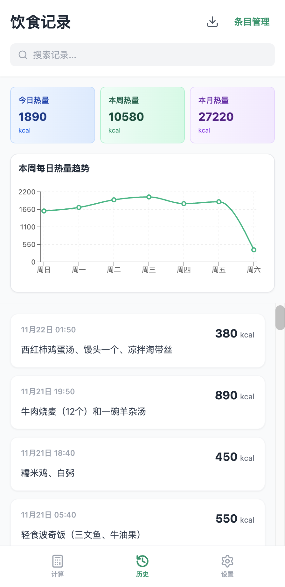
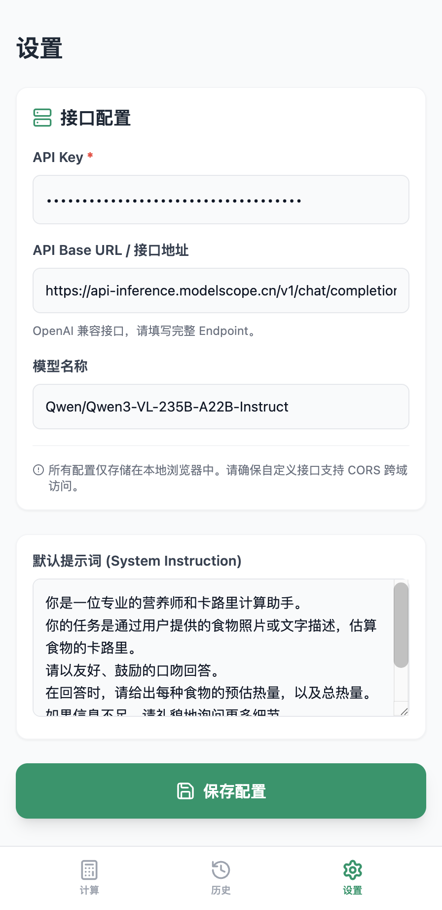

# AI 卡路里计算器

一个基于 OpenAI 兼容 API 的渐进式 Web 应用（PWA），通过照片分析帮助您快速估算食物卡路里。

## 应用界面

| 计算界面                                  | 历史记录                                 | 设置界面                              |
| ----------------------------------------- | ---------------------------------------- | ------------------------------------- |
|  |  |  |

## 功能特性

- 📸 **图像识别**：上传食物照片，AI 自动识别食物并估算卡路里
- 💬 **对话式交互**：支持与 AI 聊天，精炼卡路里估算结果
- 📊 **历史记录**：保存您的进食记录，方便追踪饮食
- ⚙️ **API 配置**：支持自定义 OpenAI 兼容接口（如 ModelScope 等）
- 📱 **PWA 支持**：可安装为独立应用，离线可用

## 使用方法

### 1. 配置AI接口

首次使用前，需要在设置界面配置AI接口：

1. 点击底部的"设置"标签
2. 填入您的 API Key（必填）
3. 如需其他使用 OpenAI 兼容接口，请在"API Base URL"中填入接口地址（可选）
4. 填入您想使用的模型名称（如：gpt-4-vision-preview）
5. **重要提示**：所使用的模型必须支持图片输入
6. 点击"保存配置"

> **注意**：API密钥等信息将会保存在本地，代码在GitHub开源，无需担心密钥信息被恶意上传到其他地方。您可以从 ModelScope 等平台获取免费密钥。

### 2. 计算卡路里

1. 点击底部的"计算器"标签
2. 点击相机图标拍摄食物照片，或直接输入食物描述
3. AI将自动分析并计算卡路里
4. 如果计算结果有误，可以继续输入文字与AI对话进行纠正
5. 点击"保存记录"按钮保存本次结果

### 3. 保存记录与数据管理

- 点击"保存记录"后，AI将解析聊天记录，并保存最终结果到本地
- 所有API调用和记录都只保存在本地，没有数据泄漏风险
- **重要提醒**：请经常在历史记录界面导入和导出历史数据，防止意外丢失数据
- 在历史记录界面可以随时查看、管理您的进食记录

## 安装与运行

### 环境要求

- Node.js 18 或更高版本

### 安装步骤

1. 克隆或下载项目到本地
2. 安装依赖：

   ```bash
   npm install
   ```
3. 启动开发服务器：

   ```bash
   npm run dev
   ```
4. 打开浏览器访问 `http://localhost:5173`

### 构建生产版本

```bash
npm run build
```

## API 配置说明

### 使用 OpenAI API

- API Key: 您的 OpenAI API Key
- API Base URL: `https://api.openai.com/v1/chat/completions`
- 模型名称: `gpt-4-vision-preview` 或其他支持视觉的模型

### 使用 ModelScope API

- API Key: 您的 ModelScope API Key
- API Base URL: `https://api-inference.modelscope.cn/v1/chat/completions`
- 模型名称: 您选择的模型名称

### 使用其他 OpenAI 兼容接口

只需填入对应的 API Base URL 和模型名称即可。

## 自定义系统提示词

在设置页面可以自定义系统提示词，用于指导 AI 如何分析食物和估算卡路里。

## 注意事项

- 所有配置和数据仅存储在本地浏览器中，不会上传到任何服务器
- 请确保您使用的 API 接口支持 CORS 跨域访问
- 卡路里估算结果仅供参考，实际数值可能因食物制作方式、分量等因素有所不同
- 为防止数据丢失，请定期在历史记录界面导出数据备份
- 本应用不会收集或传输您的任何数据，所有处理均在本地完成

## 文件结构

```
ai-calorie-counter/
├── components/           # React 组件
│   ├── Calculator.tsx   # 计算器主界面
│   ├── History.tsx      # 历史记录界面
│   ├── Settings.tsx     # 设置界面
│   └── BottomNav.tsx    # 底部导航栏
├── services/            # 服务类
│   └── aiService.ts     # API 服务（使用 OpenAI 兼容接口）
├── utils/               # 工具函数
│   └── storage.ts       # 本地存储工具
├── types.ts             # 类型定义
├── App.tsx              # 应用主组件
├── index.html           # HTML 入口文件
└── package.json         # 项目配置
```

## 贡献

欢迎提交 Issue 和 Pull Request 来改进这个项目。
